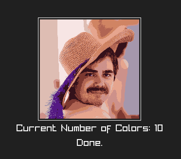

---

# 🎨 Color Quantization with K-Means (C + Raylib)

This project implements **color quantization** using the **K-Means clustering algorithm** in C. It reduces the number of unique colors in an image, helping with compression and artistic effects. The result is visualized in real time using [Raylib](https://www.raylib.com/).

---

## 🖼️ What It Does

* Loads an input image (supports JPG, PNG, etc.)
* Reduces the color palette to *K* colors using K-Means
* Displays the quantized image
* Allows user to control number of output colors dynamically
* Can export the quantized image

---

## 📦 Dependencies

* [Raylib](https://github.com/raysan5/raylib) (for graphics and UI)
* [stb\_image.h](https://github.com/nothings/stb) and \[stb\_image\_write.h] (for image loading/saving)

Make sure these headers are available in your include path:

```c
#include "stb_image.h"
#include "stb_image_write.h"
#include "raylib.h"
```

---

## 🧪 Usage

### 🛠️ Build (Linux/Mac)

```bash
make build
```
or
```
gcc main.c -o main -Iraylib/include -Lraylib/lib -l:libraylib.a -lm
```

### 🧠 Run

```bash
./main input.png output.png
```

### 🪄 Controls

| Key     | Action                                         |
| ------- | ---------------------------------------------- |
| `0-9`   | Input number of colors (e.g., 1, 2, 3, 4, etc) |
| `Q`     | Run quantization                               |
| `S`     | Save quantized image to output path            |
| `R`     | Reset Entered number of colors                 |
| `ESC`   | Exit                                           |

---

## 🖌️ How It Works

1. **Initialization**:

   * Image is loaded using `stb_image`.
   * Colors are extracted and converted to RGB float format.

2. **Clustering**:

   * Initial centroids are picked randomly.
   * Pixels are assigned to the closest centroid using Euclidean distance.
   * Centroids are updated iteratively (`MAX_ITER = 30`).

3. **Quantization**:

   * Each pixel is replaced by its cluster's centroid color.

4. **Rendering**:

   * Uses `Raylib` to draw the quantized image and UI.

---

## 📂 Example

```bash
./quantize lena.png lena_quantized.png
```
# example output


---

## 🔍 Notes

* For small images, exact color counting is available via a hash-based method.
* The number of colors can be adjusted at runtime (just insert the number).
* Real-time rendering makes it easy to experiment visually.

---